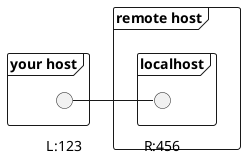
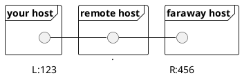
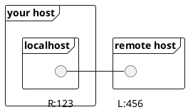
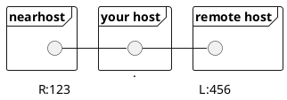

# Tunneling / Port Forwarding

## Introduction

### 1. local:

* `-L`Specifies that the given port on the local (client) host is to be forwarded to the given host and port on the remote side.
* `ssh -L sourcePort:forwardToHost:onPort`connectToHost means: connect with ssh to`connectToHost`, and forward all connection attempts to the **local **`sourcePort`to port`onPort`on the machine called`forwardToHost`, which can be reached from the`connectToHost`machine.


<!-- 
```
 your host              remotehost
╔══════════╗           ╔══════════╗
║          ║           ║localhost ║
║          ║           ║          ║
║         L:123-------R:456       ║
╚══════════╝           ╚══════════╝
``` 
-->


```bash
ssh -L 123:localhost:456 remotehost
```

---


<!--
```
 your host             remotehost             faraway-host
╔══════════╗          ╔══════════╗            ╔══════════╗
║          ║          ║          ║            ║          ║
║          ║          ║          ║            ║          ║
║         L:123------------------------------R:456       ║
╚══════════╝          ╚══════════╝            ╚══════════╝
```
-->

```bash
ssh -L 123:faraway-host:456 remotehost
```


### 2. remote:

* `-R`Specifies that the given port on the remote (server) host is to be forwarded to the given host and port on the local side.
* `ssh -R sourcePort:forwardToHost:onPort` `connectToHost` means: connect with ssh to`connectToHost`, and forward all connection attempts to the **remote **`sourcePort`to port `onPort`on the machine called `forwardToHost`, which can be reached from your`local`machine.

<!--
```
 your host              remotehost
╔══════════╗           ╔══════════╗
║localhost ║           ║          ║
║          ║           ║          ║
║         R:123-------L:456       ║
╚══════════╝           ╚══════════╝
```
-->

```bash
ssh -R 456:localhost:123 remotehost
```


---

<!--
```
 nearhost              your host               remotehost
╔══════════╗          ╔══════════╗            ╔══════════╗
║          ║          ║          ║            ║          ║
║          ║          ║          ║            ║          ║
║         R:123------------------------------L:456       ║
╚══════════╝          ╚══════════╝            ╚══════════╝
```
-->

```
ssh -R 456:nearhost:123 remotehost
```


## Examples

### Example for 1

```
ssh -L 80:localhost:80 SUPERSERVER
```

You specify that a connection made to the local port 80 is to be forwarded to port 80 on SUPERSERVER. That means if someone connects to your computer with a webbrowser, he gets the response of the webserver running on SUPERSERVER. You, on your local machine, have no webserver running.

### Example for 2

```
ssh -R 80:localhost:80 tinyserver
```

You specify, that a connection made to the port 80 of tinyserver is to be forwarded to port 80 on your local machine. That means if someone connects to the small and slow server with a webbrowser, he gets the response of the webserver running on your local machine. The tinyserver, which has not enough diskspace for the big website, has no webserver running. But people connecting to tinyserver think so.

### More examples

Other things could be: The powerful machine has five webservers running on five different ports. If a user connects to one of the five tinyservers at port 80 with his webbrowser, the request is redirected to the corresponding webserver running on the powerful machine. That would be

```
ssh -R 80:localhost:30180 tinyserver1
ssh -R 80:localhost:30280 tinyserver2
etc.
```

Or maybe your machine is only the connection between the powerful and the small servers. Then it would be (for one of the tinyservers that play to have their own webservers):

```
ssh -R 80:SUPERSERVER:30180 tinyserver1
ssh -R 80:SUPERSERVER:30280 tinyserver2
etc
```

## Links

* [http://unix.stackexchange.com/questions/115897/whats-ssh-port-forwarding-and-whats-the-difference-between-ssh-local-and-remot](http://unix.stackexchange.com/questions/115897/whats-ssh-port-forwarding-and-whats-the-difference-between-ssh-local-and-remot)
* [http://www.rzg.mpg.de/services/network/secure-shell/ssh-tunnelling-port-forwarding](http://www.rzg.mpg.de/services/network/secure-shell/ssh-tunnelling-port-forwarding)
* [https://help.ubuntu.com/community/SSH/OpenSSH/PortForwarding](https://help.ubuntu.com/community/SSH/OpenSSH/PortForwarding)
* [https://chamibuddhika.wordpress.com/2012/03/21/ssh-tunnelling-explained/](https://chamibuddhika.wordpress.com/2012/03/21/ssh-tunnelling-explained/)
* [http://www.mpcdf.mpg.de/services/network/secure-shell/ssh-tunnelling-port-forwarding](http://www.mpcdf.mpg.de/services/network/secure-shell/ssh-tunnelling-port-forwarding)


